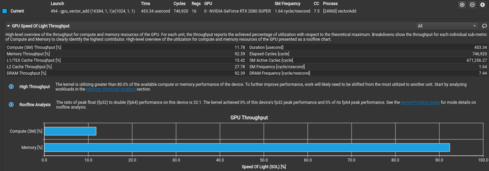
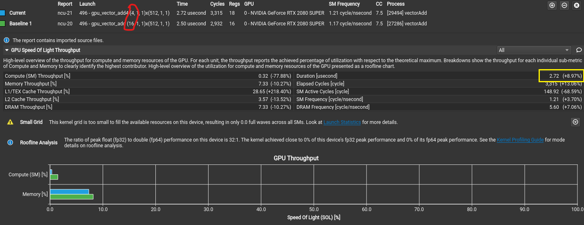
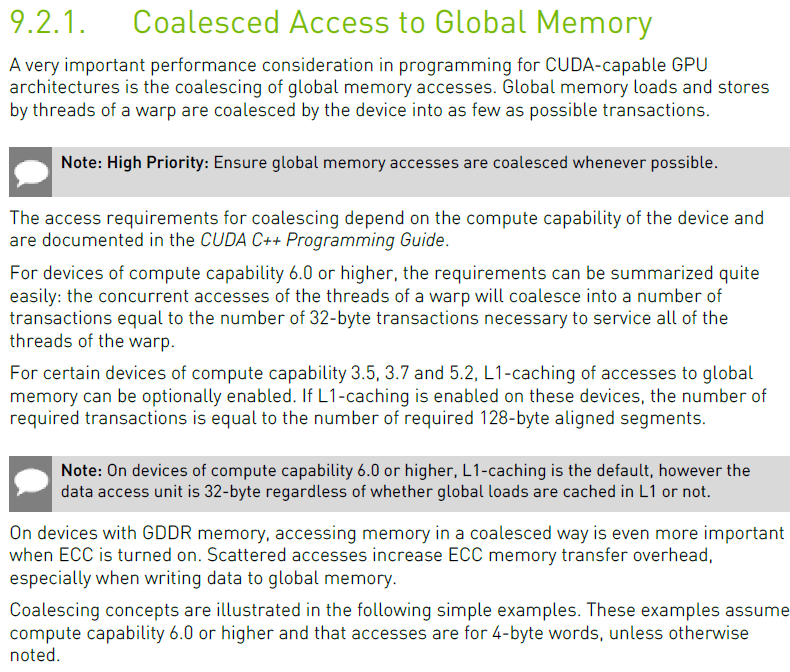
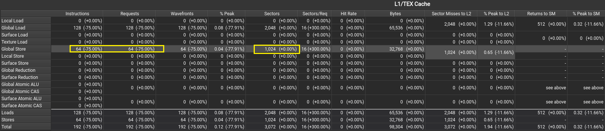
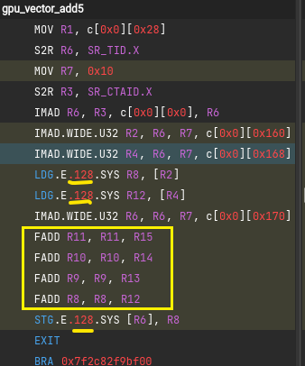
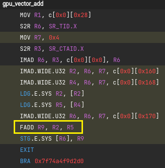

<center>Vector Add Profiling</center>

[toc]

#### Basic Implementation

**Formula:**

$$
\mathbf{C} = \mathbf{A} + \mathbf{B}
$$

**Characters**:

1. Memory Bound：Each element only read or write from global memory once.

   _As below, memory throughput is over 90% while compute throughput is around
   10%._ 

#### Optimization

1. Maximum total threads number is the best practice until program hit the
   maximum memory throughput.
2. Use float4 could accelerate loading speed while parallelizing computing.

   **Analysis**:

   1. Compute throughput decrease 77% due to grid size is 1/4 of original
      implementation.
   2. Memory throughput don't have any change, better or worse. -- Analyze at
      [Theoretical Analysis](#theoretical-analysis)

   

   **Eg**: Below float4 "+" operator is overloaded via <helper_math.h> from cuda
   samples.

   _Vector add implementation:_

   ```cpp
   __global__ void gpu_vector_add(float4 *vector1, float4 *const vector2,
                               float4 *vector_sum, const unsigned int length) {
       unsigned int tid = threadIdx.x + blockDim.x * blockIdx.x;
       vector_sum[tid] = vector1[tid] + vector2[tid];
   }
   ```

   _float4 "+" operator overload in <helper_math.h>:_

   ```cpp
   __VECTOR_FUNCTIONS_DECL__ float4 make_float4(float x, float y, float z, float w){
       float4 t; t.x = x; t.y = y; t.z = z; t.w = w; return t;
   }

   inline __host__ __device__ float4 operator+(float4 a, float4 b){
       return make_float4(a.x + b.x, a.y + b.y, a.z + b.z,  a.w + b.w);
   }

   inline __host__ __device__ void operator+=(float4 &a, float4 b){
       a.x += b.x;
       a.y += b.y;
       a.z += b.z;
       a.w += b.w;
   }
   ```

#### [Theoretical Analysis](#theoretical-analysis)

1. Why float4 doesn't take effect?

   A: Because GPU use **sector** load data which is 32 bytes alignment. Vector
   length and data load&store size are all natural 32 bytes alignment in this
   program. `float4` could assist programmer deploy 32 bytes alignment data per
   wrap actually.

   [9.2.1 Coalesced Access to Global Memory](https://docs.nvidia.com/cuda/cuda-c-best-practices-guide/index.html#coalesced-access-to-global-memory)
   from `<Cuda C Best Practice Guide>`
   

   Calculation based on this program, as expected.

   $$
   8192(elements) \times sizeof(float) \div 1024(sectors) = 32 (bytes/sector)
   $$

   

   2. What's `float4`'s real effect?

   A: Positive: `float4` force load&store as 4-bytes alignment.

   Negative:Computing is still one by one. Original disassembly code is as
   below.

   _`float4` version:_

   

   _regular `float` version:_

   
