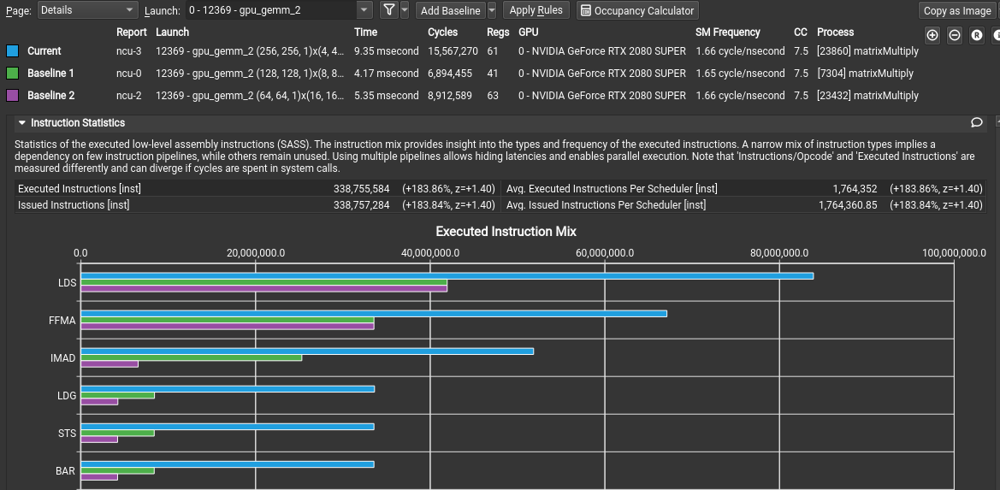

<center>SGEMM Profiling</center>

[toc]

#### Background

This trial is same as
[CUDA SGEMM 优化](http://conf01.birentech.com:8090/pages/viewpage.action?pageId=29676647)
but this only contains tiling and shared memory optimization.

**Formula:**

$$
\begin{matrix}C\end{matrix}=\alpha\cdot\begin{matrix}A\end{matrix} \ast
\begin{matrix}B\end{matrix} + \beta\cdot\begin{matrix}C\end{matrix}
$$

_PS: During this experiment, all matrix are square matrix._

#### Metrics

`cublasSgemm()` is the best implementation on Nvidia GPU. Comparison rate with
`cublasSgemm()` is a general metric.

_Notes: CuBlas use column-major order as default._

#### Basic implementation

This version is the simplest implementation with regular manually computing
logic. It doesn't take any hardware feature into consideration.

  
_Figure 1. result:_

_Source code:_

```cpp
__global__ void gpu_gemm(const unsigned int m, const unsigned int n,
                         const unsigned int k, const float alpha,
                         const float *mat1, const float *mat2, const float beta,
                         float *mat3) {
  float temp_prod = 0.0f;
  unsigned int tidx = threadIdx.x * n + blockIdx.x;
  for (unsigned int b = 0; b < n; ++b) {
    temp_prod += mat1[b * n + blockIdx.x] * mat2[b + threadIdx.x * n];
  }
  mat3[tidx] = alpha * temp_prod + beta * mat3[tidx];
}
```

#### Tiling + shared memory:

It is same logic as Chapter 3 of
[CUDA SGEMM 优化](http://conf01.birentech.com:8090/pages/viewpage.action?pageId=29676647).
Please refer to it if you want to learn theory. This article only discuss some
topics met during profiling.

1. Compiler options -- `fma` instruction and `#pragma unroll`

Background:

- 'fma' is short for 'fused multiply-add' which means execute
  $d = a \times b + c$ with only one instruction.
- 'unroll' is a general optimization method to reduce branch prediction cost.

Both two are recommended method for programmer, but NVCC implements both without
manual configuration.

In Figure 2, yellow arrow shows the multiply-add operation is optimized to `fma`
instruction automatically. Green arrow shows the internal cycle is unrolled by
compiler. (TILE_LENGTH_0 = 8). External cycle is also partially unrolled with 2
control logic.

  
_Figure 2. Asm code:_

2. Tile batch size.

   Two experiments indicate the same best tile size is 8.

   | Version       | Matrix Length | 1024    | Matrix Length | 512     |
   | ------------- | ------------- | ------- | ------------- | ------- |
   |               | Time(ms)      | rate(%) | Time(ms)      | rate(%) |
   | cuBlas        | 0.252         |         | 0.05          |         |
   | TileLength-32 | 9.807         | 2.57    | 1.33          | 3.76    |
   | 16            | 5.360         | 4.70    | 0.695         | 7.19    |
   | 8             | 4.178         | 6.03    | 0.541         | 9.24    |
   | 4             | 9.444         | 2.67    | 1.187         | 4.21    |

   Two comparison analysis are list which are based on Nsight Compute. Note
   that, this is my guess. It'd be better to profile your program before
   applying it.

   a. Tile length == 4: Block size 16 is lower than 32 threads per warp
   requirement which lead to more warp numbers.

   As below figure, Tile 4 used double counts of 'LDS' and 'FFMA' instructions
   than tile8 and tile16. And Tile4 occupancy is 50% while the others are 100%.
   As GPU hardware design, warp size is 32 threads. Small size lead to there are
   two block running in one warp.

     
   _Figure 3. Tile length 8 vs 4 vs 16_

     
   _Figure 4. warp occupacy comparison_

   b. Tile length == 16: Register per thread is not enough for unrolling.

   Figure 5 shows tile 16 version is at the cross point of two axises(warp
   occupancy and registers per thread). And from bellow two figures, we can know
   compilers has to compress unrolling logic to make full use of warp occupancy.
   This result in long execution time.

     
   _Figure 5. Occupancy limit analysis_

     
   _Figure 6. internal cycle first unrolling is normal_

     
   _Figure 7. internal cycle later unrolling is disordered to reuse registers_

3. Matrix size.

   Tile length is 8. Cublas has better performance with large matrix size.

   | Matrix Side Length | CuBlas(ms) | Tiling(ms) | Compatible rate(%) |
   | ------------------ | ---------- | ---------- | ------------------ |
   | 128                | 0.0367     | 0.0134     | 273.88             |
   | 256                | 0.0178     | 0.077      | 23.12              |
   | 512                | 0.0511     | 0.54       | 9.46               |
   | 1024               | 0.255      | 4.175      | 6.11               |

```cpp
#define TILE_LENGTH_0 8
#define TILE_SIZE_0 TILE_LENGTH_0 *TILE_LENGTH_0
__global__ void gpu_gemm_2(const unsigned int m, const unsigned int n,
                           const unsigned int k, const float alpha,
                           const float *mat1, const float *mat2,
                           const float beta, float *mat3) {
  __shared__ float temp_1[TILE_LENGTH_0][TILE_LENGTH_0];
  __shared__ float temp_2[TILE_LENGTH_0][TILE_LENGTH_0];
  unsigned int id_col_m =
      ((blockIdx.y * blockDim.y + threadIdx.y) * gridDim.y + blockIdx.x) *
          blockDim.x +
      threadIdx.x;
  float temp_prod = mat3[id_col_m];
  for (unsigned int tile_num = 0; tile_num < gridDim.x; tile_num++) {
    // load Matrix from globalMem to shared memory.
    unsigned int id_1 =
        ((blockIdx.y * blockDim.y + threadIdx.y) * gridDim.y + tile_num) *
            blockDim.x +
        threadIdx.x;
    unsigned int id_2 =
        ((tile_num * blockDim.y + threadIdx.y) * gridDim.y + blockIdx.x) *
            blockDim.x +
        threadIdx.x;
    temp_1[threadIdx.x][threadIdx.y] = mat1[id_1];
    temp_2[threadIdx.x][threadIdx.y] = mat2[id_2];
    __syncthreads();
// calculatation
// #pragma unroll
    for (unsigned int i = 0; i < TILE_LENGTH_0; i++) {
      // temp_prod = fmaf(temp_1[i][blockIdx.y], temp_2[blockIdx.x][i],
      // temp_prod);
      temp_prod += temp_1[i][threadIdx.y] * temp_2[threadIdx.x][i];
      // temp_prod += temp_1[threadIdx.x][i] * temp_2[i][threadIdx.y];
    }
    __syncthreads();
  }
  mat3[id_col_m] = temp_prod;
}
```
