<div align='center' ><font size='70'>Shared Memory Based Reduction</font></div>

[TOC]

# 文中提到的七步优化

## 1 Interleaved Addressing

尽量在shared_memory上跑运算，而不是global memory.
使用间隔的加法。 初步实现了并行化。
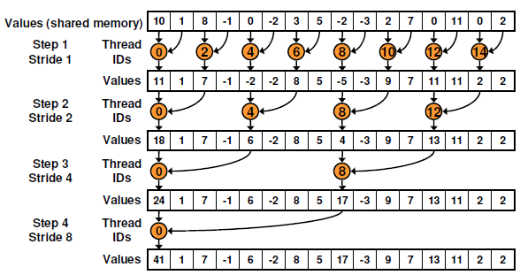

## 2 Avoid Divergence

注意避免divergence – 注意判断语句if/switch等
还有%取余运算符效率比较低，需要改用乘法。
改之前：
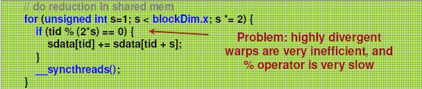
改之后：
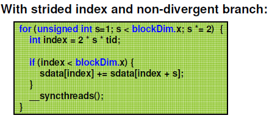

## 3 Sequential Addressing

更改stride, 利用局部性原理，尽可能去读/写相近的位置。避免shared memory bank conflicts.
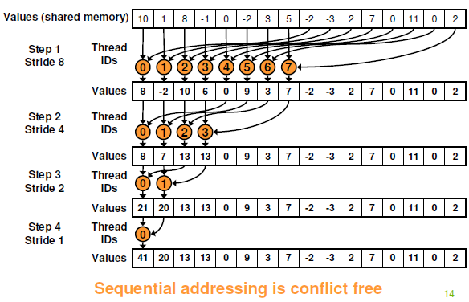

## 4 First Add During Load

边读边加，占满block里面所有的thread.
之前的加法只有一半的thread参与，剩余的thread idle.
所有thread都参与，直接从global memory去读，做加法，写入shared memory.
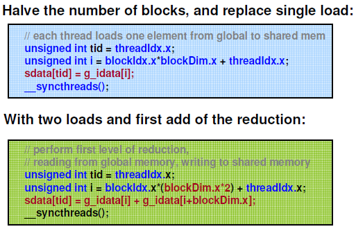

## 5 Unroll The Last Warp

单独写一个 `__device__` 函数来操作
小于一个32 threads时，SIMD原理自动就可以实现同时计算，不需要sync等强制操作，直接接逐层挨个加过去就可以。
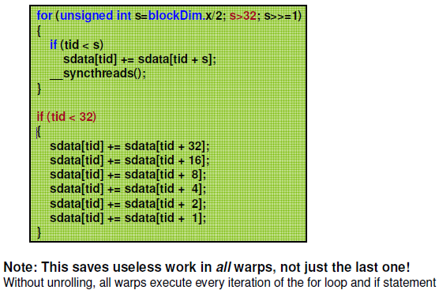

## 6 Completely Unrolled
基于block_size的unroll
用模板template, 定义不同的block_size下的所有函数操作。 – 每次不会有线程浪费。
code：
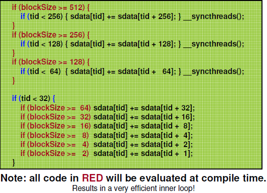
调用时的实际情况：
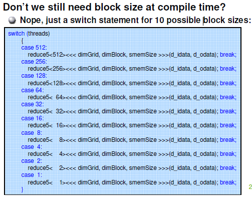
## 7 Multi Adds Per Thread

> - 并行算法复杂度分析
> step复杂度：O(logN) – 每步计算N/2^S，一共需要logN步。
> workload复杂度：O(N) – 一共需要N个add计算。和并行算法一样。
> 时间复杂度：O(logN). – 计算过程：时间复杂度为总计算的时间(O(N/P),P为threads count)+step的时间(O(logN))
> → N和P都比较大，P可以接近N，所以N/P接近1的常数，可以忽略。→ 得到O(logN)。
> 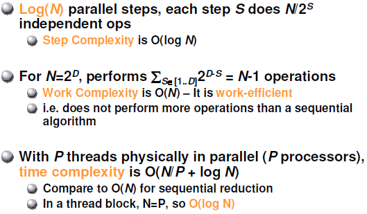
> - Cost分析
> 分析：cost = threads x time = O(N) x O(logN)  → 不是最cost efficient的。
> Brent's theorem定理: 使用N/logN个thread效率最高，最终cost = O(N/logN * logN)= O(N) → 又称作算法级联
> 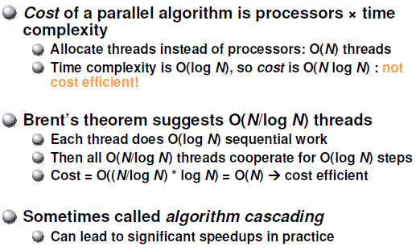
> - 算法级联Algorithm Cascading
> 混合并行和串行算法，每个thread进行多次计算. 又称Tree-based reduction.
> 根据Brent's therorem,每个thread进行O(logN)个计算。
> 根据作者经验(+硬件实现)，每个线程可以进行更深度的计算， 可以：
>   1. 隐藏load&add之间的latency;
>   2. 一个block里面更多的threads可以减少级间调用的开销
>   3. 最后一级的kernel launch overhead比较严重。
> 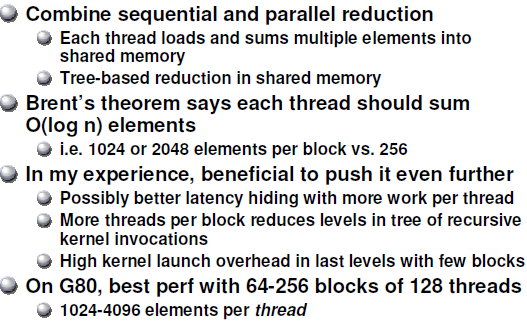

基于Brent's theorem, 之前还没有达到理论极限，可以增加线程运算深度，来减少load/store数据带来的损失。 → latency hiding.
可以通过调整线程数量和每个线程里面进行运算深度来优化到最优O(N).
Code：通过gridSize loop stride来控制级联。
Question: gridSize is N/log(N)?
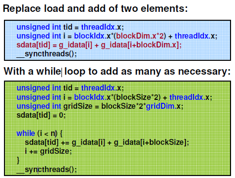

Code
- Interleaved Addressing
```cpp
/**
 * Below code could only reduce in one block.
 **/
__global__ void reduce0(int *g_idata, int *g_odata) {
    extern __shared__ int sdata[];
    // each thread loads one element from global to shared mem
    unsigned int tid = threadIdx.x;
    unsigned int i = blockIdx.x*blockDim.x + threadIdx.x;
    sdata[tid] = g_idata[i];
    __syncthreads();
    // do reduction in shared mem
    for(unsigned int s=1; s < blockDim.x; s *= 2) {
        if (tid % (2*s) == 0) { sdata[tid] += sdata[tid + s]; }
        __syncthreads();
    }
    // write result of each block to global memory
    if (tid == 0) g_odata[blockIdx.x] = sdata[0];
}
```
- Final Optimized Kernel
```cpp
/**
 * blockSize is user defined. TODO: How to select blockSize and gridDim? N/logN?
 * @Parameter: n: data counts.
 **/
template <unsigned int blockSize>
__global__ void reduce6(int *g_idata, int *g_odata, unsigned int n)
{
    extern __shared__ int sdata[];
    unsigned int tid = threadIdx.x;
    unsigned int i = blockIdx.x*(blockSize*2) + tid;
    unsigned int gridSize = blockSize*2*gridDim.x;
    sdata[tid] = 0;
    // the bigest level
    while (i < n) { sdata[tid] += g_idata[i] + g_idata[i+blockSize]; i += gridSize; }
    __syncthreads();
    // each level
    if (blockSize >= 512) { if (tid < 256) { sdata[tid] += sdata[tid + 256]; } __syncthreads(); }
    if (blockSize >= 256) { if (tid < 128) { sdata[tid] += sdata[tid + 128]; } __syncthreads(); }
    if (blockSize >= 128) { if (tid < 64) { sdata[tid] += sdata[tid + 64]; } __syncthreads(); }
    if (tid < 32) {
        if (blockSize >= 64) sdata[tid] += sdata[tid + 32];
        if (blockSize >= 32) sdata[tid] += sdata[tid + 16];
        if (blockSize >= 16) sdata[tid] += sdata[tid + 8];
        if (blockSize >= 8) sdata[tid] += sdata[tid + 4];
        if (blockSize >= 4) sdata[tid] += sdata[tid + 2];
        if (blockSize >= 2) sdata[tid] += sdata[tid + 1];
    }
    if(tid == 0) g_odata[blockIdx.x] = sdata[0];
}
```
- Final Performance Comparison
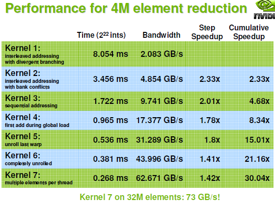
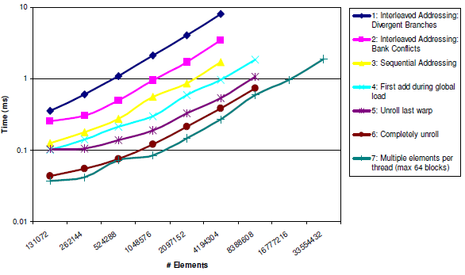

# General Conclusion

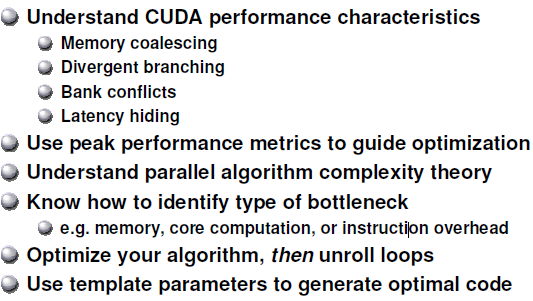

# Experiment

## Test Environment

RTX3060 + CUDA Toolkit 11.8 + 4M elements(2^22)

## Result

| |time(us)|Step Speedup|Cumulative Speedup|
|-|-|-|-|
|1|Interleaved Addressing|520| | |
|2|Reduce divergence|353|1.473088|1.473088|
|3|Sequential Addressing|333|1.06006|1.561562|
|4|First add during global load|186|1.790323|2.795699|
|5|Unroll last warp|131|1.419847|3.969466|
|6|Completely unroolled|123|1.065041|4.227642|
|7|Multiple elements per thread||||


## Lesson Learning and Kernel Compare

- Exp-1 Interleaved Addressing
1. 所有的demo code都是基于block内的reduce, 如果vector size比较大，需要进行block、grid切分，并且需要多次调用kernel进行reduce.
2. Kernel launch时传入的shared memory size是一个block需要的shared的memory size. 
3. 单个block分配的shared memory size不能超过48K。 总共shared memory size参考spec，不过使用中总共似乎没有太强的限制(因为所有block实际不是同时执行的)。

- Exp-4 First Add During Global Load
由于first add during global load， 每个block处理的数据量加倍了，对应的block(thread)量应该减半。

- Exp-5 Unroll Last Warp
自从Volta Arch开始，SIMT的调度颗粒度是thread而不是warp，所以每个thread要看成是独立运行的(并发但不是同时)[3]。在CUDA 9中大幅更新的warp-level primitive, 只有几个原语才能保证32个thread同步。所以，unroll的last warp中，
  1. 每次 += 后要用 __syncwarp() 同步一下；
  2. += 左右如果均为shared memory，则为shared memory既读又写的情况，是典型的race competion. 需要用中间的临时变量过渡[2]。PS: 目前code中不过渡也可以pass. -- 这个和目前reduction的场景不一致。keep in mind of this conception but do not need in reduction code.
Note: Code in NV's paper could not work now.
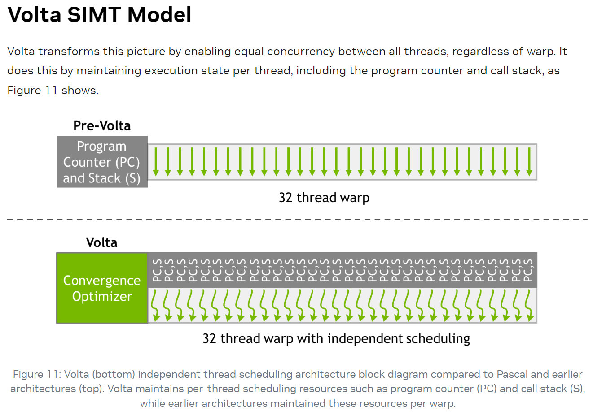
  a. NV Code:
    ```cpp
    for (unsigned int s=blockDim.x/2; s>32; s>>=1) {
    if (tid < s) sdata[tid] += sdata[tid + s];
    __syncthreads();
    }
    if (tid < 32) {
    sdata[tid] += sdata[tid + 32];
    sdata[tid] += sdata[tid + 16];
    sdata[tid] += sdata[tid + 8];
    sdata[tid] += sdata[tid + 4];
    sdata[tid] += sdata[tid + 2];
    sdata[tid] += sdata[tid + 1];
    }
    ```
    b. New Code:
    ```cpp
    // do reduction in shared mem
    for (int s = blockDim.x / 2; s > 32; s >>= 1) {
    if (threadIdx.x < s) {
        sdata[threadIdx.x] += sdata[threadIdx.x + s];
    }
    __syncthreads();
    }
    // unroll the last warp
    if (threadIdx.x < 32) {
    // float tmp = sdata[threadIdx.x];
    // tmp += sdata[threadIdx.x + 32];
    // sdata[threadIdx.x] = tmp;
    sdata[threadIdx.x] += sdata[threadIdx.x + 32];
    __syncwarp();
    // tmp += sdata[threadIdx.x + 16];
    // sdata[threadIdx.x] = tmp;
    sdata[threadIdx.x] += sdata[threadIdx.x + 16];
    __syncwarp();
    // tmp += sdata[threadIdx.x + 8];
    // sdata[threadIdx.x] = tmp;
    sdata[threadIdx.x] += sdata[threadIdx.x + 8];
    __syncwarp();
    // tmp += sdata[threadIdx.x + 4];
    // sdata[threadIdx.x] = tmp;
    sdata[threadIdx.x] += sdata[threadIdx.x + 4];
    __syncwarp();
    // tmp += sdata[threadIdx.x + 2];
    // sdata[threadIdx.x] = tmp;
    sdata[threadIdx.x] += sdata[threadIdx.x + 2];
    __syncwarp();
    // tmp += sdata[threadIdx.x + 1];
    // sdata[threadIdx.x] = tmp;
    sdata[threadIdx.x] += sdata[threadIdx.x + 1];
    // __syncwarp();
    }
    ```

- Exp-6 Comletely Unrolled
Demo code里面没有包含blockDim.x == 1024的情况。
  a. NV Code:
    ```cpp
    for (unsigned int s=blockDim.x/2; s>32; s>>=1) {
    if (tid < s) sdata[tid] += sdata[tid + s];
    __syncthreads();
    }
    if (tid < 32) {
    sdata[tid] += sdata[tid + 32];
    sdata[tid] += sdata[tid + 16];
    sdata[tid] += sdata[tid + 8];
    sdata[tid] += sdata[tid + 4];
    sdata[tid] += sdata[tid + 2];
    sdata[tid] += sdata[tid + 1];
    }
    ```
    b. New Code:
    ```cpp
    // do reduction in shared mem
    if (blockDim.x == 1024) {
    if (threadIdx.x < 512) sdata[threadIdx.x] += sdata[threadIdx.x + 512];
    __syncthreads();
    }
    if (blockDim.x >= 512) {
    if (threadIdx.x < 256) sdata[threadIdx.x] += sdata[threadIdx.x + 256];
    __syncthreads();
    }
    if (blockDim.x >= 256) {
    if (threadIdx.x < 128) sdata[threadIdx.x] += sdata[threadIdx.x + 128];
    __syncthreads();
    }
    if (blockDim.x >= 128) {
    if (threadIdx.x < 64) sdata[threadIdx.x] += sdata[threadIdx.x + 64];
    __syncthreads();
    }
    // unroll the last warp
    if (threadIdx.x < 32) {
    float tmp = sdata[threadIdx.x];
    tmp += sdata[threadIdx.x + 32];
    sdata[threadIdx.x] = tmp;
    __syncwarp();
    tmp += sdata[threadIdx.x + 16];
    sdata[threadIdx.x] = tmp;
    __syncwarp();
    tmp += sdata[threadIdx.x + 8];
    sdata[threadIdx.x] = tmp;
    __syncwarp();
    tmp += sdata[threadIdx.x + 4];
    sdata[threadIdx.x] = tmp;
    __syncwarp();
    tmp += sdata[threadIdx.x + 2];
    sdata[threadIdx.x] = tmp;
    __syncwarp();
    tmp += sdata[threadIdx.x + 1];
    sdata[threadIdx.x] = tmp;
    // __syncwarp();
    }
    ```

- Exp-7 Multiple Elements Per Thread
因为total thread count变成了N/log(N) 圆整后的值，计算block dim, grid dim变得复杂，尤其size比较大之后，多次reduce，增加了复杂度和实现难度。
在这里，blockSize和blockDim分离了，不再是简单的单(1-3)/偶(4-6)倍数关系所以NV使用模板把blockSize传进来，编译时确定，效率更高。
我的代码和NV的代码略有差别，猜测是block分配的差异造成。
PS:
  1. 目前的demo code只能pass 2^15,一个block内单次完成, 16个multiple elements计算。更大的size会有多个block, 不能pass。
  2. 计算block size的demo code也附在kernel code中。
    ```cpp
    template <unsigned int blockSize>
    __global__ void reduce6(int *g_idata, int *g_odata, unsigned int n){
        extern __shared__ int sdata[];
        unsigned int tid = threadIdx.x;
        unsigned int i = blockIdx.x*(blockSize*2) + tid;
        unsigned int gridSize = blockSize*2*gridDim.x;
        sdata[tid] = 0;
        // the bigest level
        while (i < n) { sdata[tid] += g_idata[i] + g_idata[i+blockSize]; i += gridSize; }
        __syncthreads();
        // each level
        if (blockSize >= 512) { if (tid < 256) { sdata[tid] += sdata[tid + 256]; } __syncthreads(); }
        if (blockSize >= 256) { if (tid < 128) { sdata[tid] += sdata[tid + 128]; } __syncthreads(); }
        if (blockSize >= 128) { if (tid < 64) { sdata[tid] += sdata[tid + 64]; } __syncthreads(); }
        if (tid < 32) {
            if (blockSize >= 64) sdata[tid] += sdata[tid + 32];
            if (blockSize >= 32) sdata[tid] += sdata[tid + 16];
            if (blockSize >= 16) sdata[tid] += sdata[tid + 8];
            if (blockSize >= 8) sdata[tid] += sdata[tid + 4];
            if (blockSize >= 4) sdata[tid] += sdata[tid + 2];
            if (blockSize >= 2) sdata[tid] += sdata[tid + 1];
        }
        if(tid == 0) g_odata[blockIdx.x] = sdata[0];
    }
    ```
    b. New Code
    ```cpp
    __global__ void asum_kernel(int n, const float *x, int shiftx, int incx,
                                float *result, int blockSize) {
    // statement needs constanct value. So need template.
    extern __shared__ float sdata[];
    // each thread loads one element from global to shared mem
    uint32_t id_global =
        (blockIdx.x * (blockSize * 2)) + threadIdx.x;
    // all data once per while grid(including block)
    // uint32_t grid_size = (blockSize * 2) * gridDim.x;
    uint32_t grid_size = EACH_BLOCK_SIZE_TIMES * blockDim.x;
    sdata[id_global] = 0;
    while (id_global < n) {
        // if (blockIdx.x == 1) {
        if (threadIdx.x == 0)
        printf("id_global %d is %d.\r\n", blockIdx.x, id_global);
        // }
        // calculation multi cycles
        if ((id_global + blockDim.x) < n) {
        sdata[threadIdx.x] += x[id_global] + x[id_global + blockDim.x];
        } else {
        sdata[threadIdx.x] += x[id_global];
        }
        id_global += grid_size;
    }
    __syncthreads();
    // do reduction in shared mem
    if (blockDim.x == 1024) {
        if (threadIdx.x < 512) sdata[threadIdx.x] += sdata[threadIdx.x + 512];
        __syncthreads();
    }
    if (blockDim.x >= 512) {
        if (threadIdx.x < 256) sdata[threadIdx.x] += sdata[threadIdx.x + 256];
        __syncthreads();
    }
    if (blockDim.x >= 256) {
        if (threadIdx.x < 128) sdata[threadIdx.x] += sdata[threadIdx.x + 128];
        __syncthreads();
    }
    if (blockDim.x >= 128) {
        if (threadIdx.x < 64) sdata[threadIdx.x] += sdata[threadIdx.x + 64];
        __syncthreads();
    }
    // unroll the last warp   if (threadIdx.x < 32) {
        float tmp = sdata[threadIdx.x];
        tmp += sdata[threadIdx.x + 32];
        sdata[threadIdx.x] = tmp;
        __syncwarp();
        tmp += sdata[threadIdx.x + 16];
        sdata[threadIdx.x] = tmp;
        __syncwarp();
        tmp += sdata[threadIdx.x + 8];
        sdata[threadIdx.x] = tmp;
        __syncwarp();
        tmp += sdata[threadIdx.x + 4];
        sdata[threadIdx.x] = tmp;
        __syncwarp();
        tmp += sdata[threadIdx.x + 2];
        sdata[threadIdx.x] = tmp;
        __syncwarp();
        tmp += sdata[threadIdx.x + 1];
        sdata[threadIdx.x] = tmp;
        // __syncwarp();
    }
    // write result of eac block to global mem
    if (threadIdx.x == 0) {
        result[blockIdx.x] = sdata[0];
    }
    __syncthreads();
    }
    // thread and block dim calculation.
    uint32_t total_threads = numElements / (std::log2(numElements));
    uint32_t block_dim_x = 1024; // max threads per block
    if (total_threads < block_dim_x) {
    // manually calculate block_dim_x if there is few elements
    block_dim_x = ((total_threads + 32 - 1) / 32) * 32;
    }
    uint32_t grid_dim_x = (total_threads + 1024 - 1) / 1024 / 2;
    uint32_t grid_size = block_dim_x * 2 * grid_dim_x;
    uint32_t calca_each_block = ((numElements + grid_size - 1) / grid_size);
    uint32_t block_size = calca_each_block * block_dim_x * 2;
    ```

# Reference
1. [CUDA Reduction](https://developer.download.nvidia.cn/assets/cuda/files/reduction.pdf)
2. [Using CUDA Warp-Level Primitives](https://developer.nvidia.com/blog/using-cuda-warp-level-primitives/)
3. [Inside Volta: The World’s Most Advanced Data Center GPU](https://developer.nvidia.com/blog/inside-volta/)
