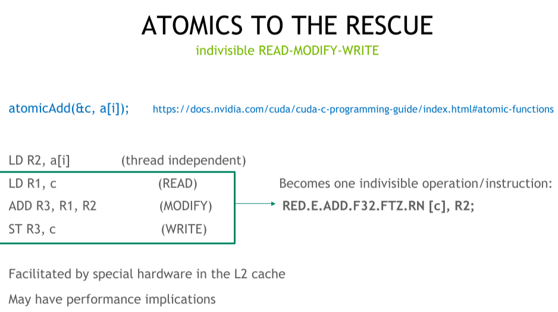
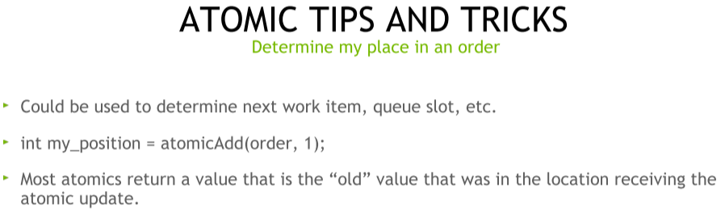
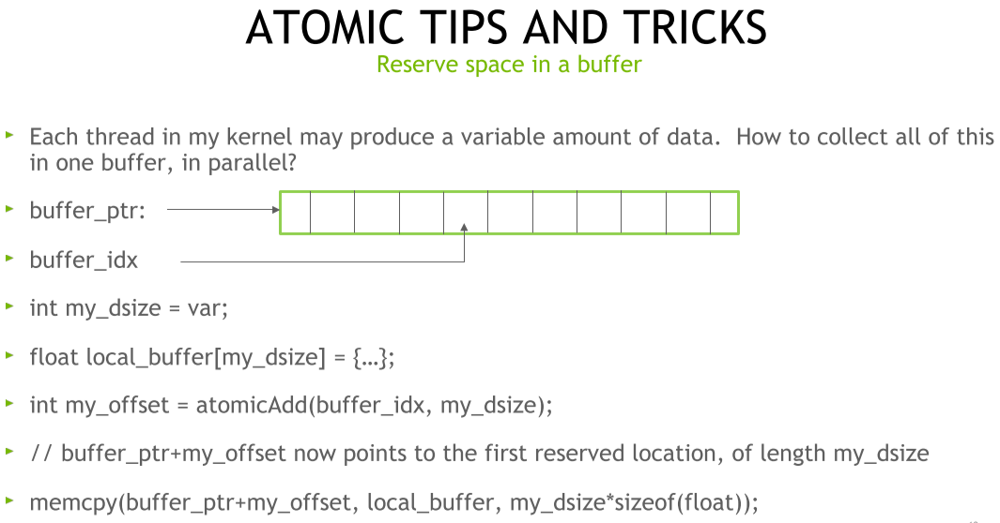
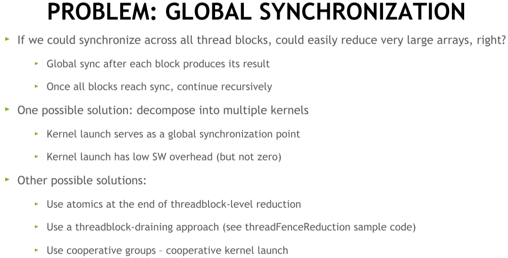
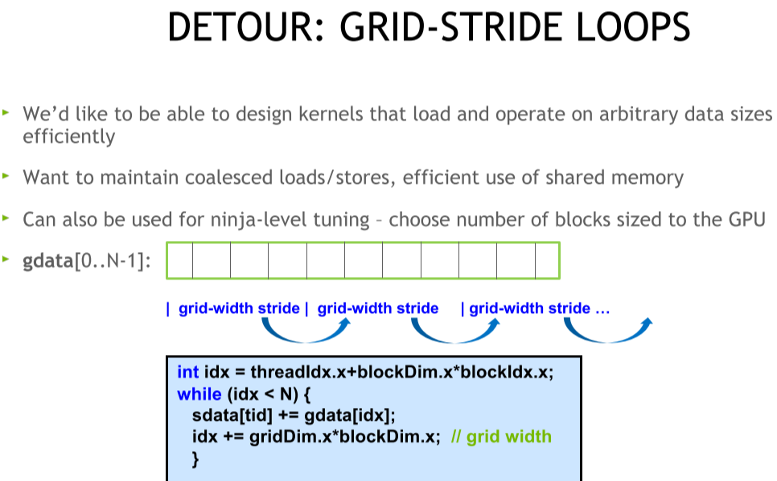
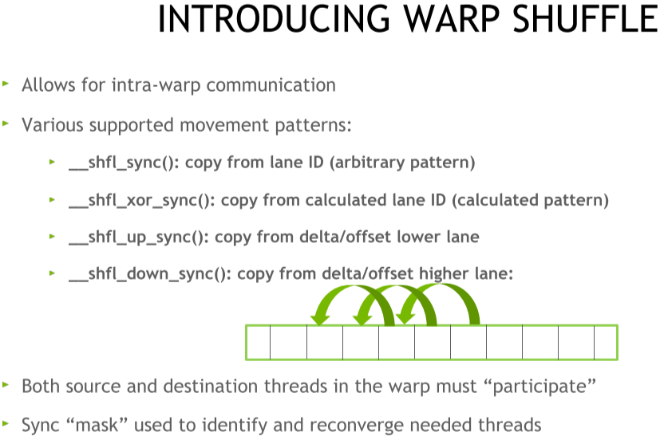
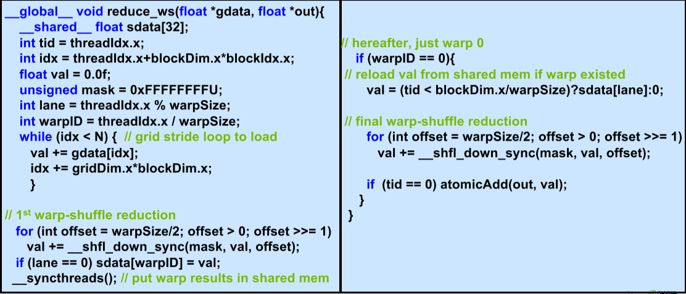
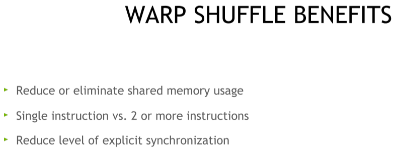
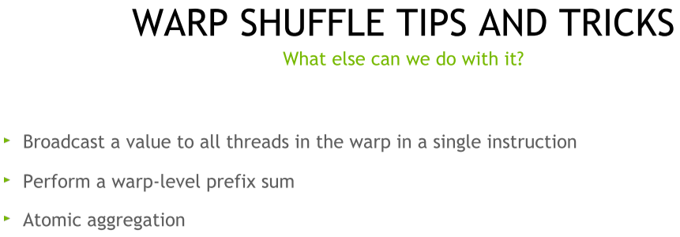

<div align='center' ><font size='70'>Warp Shuffle Based Reduction</font></div>

[TOC]

# 1. Atomics
定义：隐式的read - modify write

使用场景一：决定下一个计算的位置，通过返回值(计算前的值)来得到下一个计算的位置。

使用场景二： 在buffer中预留一部分空间


# 2. Classial Parallel Reduction

传统的用share memory的parallel reduction的问题:全局同步的问题，每个block执行完后需要global sync + 多次launch kernel.
可能的解决方案：
1. 分解到多个kernel中，在需要gloal sync的时候launch下一个？并且kernel launch的SW overhead很小。
2. 在block-level最后用atomic做加法
3. 使用threadblock-draining approach
4. 使用cooperative groups – cooperative kernel launch.


Detour(迂回) Grid-Stride Loops – 类似于Algorith Calscation


# 3. Warp shuffle
warp shuffle介绍：warp内通讯

Code:

优势：减少shared memory使用；减少指令；减少显示同步

用途/场景：广播数据、

Warp shuffle code
```cpp
__global__ void reduce_ws(float *gdata, float *out) {
  // 32*32 = 1024. At most has 32 warps.
  __shared__ float sdata[32];
  int tid = threadIdx.x;
  int idx = threadIdx.x + blockDim.x * blockIdx.x;
  float val = 0.0f;  // use tlr
  unsigned mask = 0xFFFFFFFFU;
  int lane = threadIdx.x % warpSize;
  int warpID = threadIdx.x / warpSize;
  while (idx < N) {  // grid stride loop to load
    val += gdata[idx];
    idx += gridDim.x * blockDim.x;
  }
  // 1st warp-shuffle reduction -- reduction in a warp
  for (int offset = warpSize / 2; offset > 0; offset >>= 1)
    val += __shfl_down_sync(mask, val, offset);
  if (lane == 0) sdata[warpID] = val;  // store in warp_ID location
  __syncthreads();                     // put warp results in shared mem
  // hereafter, just warp 0.
  if (warpID == 0) {
    // reload val from shared mem if warp existed
    val = (tid < blockDim.x / warpSize) ? sdata[lane] : 0;
    // final warp-shuffle reduction
    for (int offset = warpSize / 2; offset > 0; offset >>= 1)
      val += __shfl_down_sync(mask, val, offset);
    // do reduction cross blocks.
   if (tid == 0) atomicAdd(out, val);
  }
}
```

# Experiment

简单实验了一下，耗时78 us，比之前其他版本performance都要好。
| |time(us)|Step Speedup|Cumulative Speedup|
|-|-|-|-|
|1|Interleaved Addressing|520| | |
|2|Reduce divergence|353|1.473088|1.473088|
|3|Sequential Addressing|333|1.06006|1.561562|
|4|First add during global load|186|1.790323|2.795699|
|5|Unroll last warp|131|1.419847|3.969466|
|6|Completely unroolled|123|1.065041|4.227642|
|7|Multiple elements per thread||||
|8|Warp Shuffle|78|||

# Reference
1. [05_Atomics_Reductions_Warp_Shuffle.pdf](https://www.olcf.ornl.gov/wp-content/uploads/2019/12/05_Atomics_Reductions_Warp_Shuffle.pdf)
